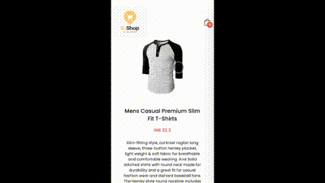

# E-commerce - React & Tailwind 🛒👜 (Assignment of Profile.fy)

Welcome to the **E-commerce - React & Tailwind** project! This is a modern e-commerce web application built using **React** for the frontend and **Tailwind CSS** for styling.

## Table of Contents

- [Project Overview](#project-overview)
- [Features](#features)
- [Videos](#videos)
- [Tech Stack](#tech-stack)
- [Installation](#installation)
- [Usage](#usage)
- [Contributing](#contributing)
- [Contact](#contact)

## Project Overview

This project aims to create a fully functional e-commerce website where users can browse products, add items to their cart, apply discount codes, and complete purchases. The UI is styled with Tailwind CSS, ensuring a responsive and visually appealing design across all devices. Data for the products is sourced from the [Fakestore API](https://fakestoreapi.com).

## Features

- **Responsive Design**: Seamless experience on both desktop and mobile devices.
- **Product Catalog**: Browse products with images, descriptions, and prices.
- **Shopping Cart**: Add, remove, and update products in the cart.
- **Discount Code Functionality**: Apply percentage or fixed discounts to the cart total.
- **Notifications**: Real-time alerts when items are added to the cart or discount codes are applied.
- **Hover Effects**: Enhanced hover effects on product images.
- **Custom CSS**: Tailwind CSS configuration tailored to the project's needs.
- **Cross-Browser Compatibility**: Ensures consistent performance across various web browsers.

## Videos

### Project Demo

  

## Tech Stack

- **Frontend**: React.js
- **Styling**: Tailwind CSS
- **Package Manager**: npm
- **Build Tool**: Vite.js (for fast development and optimized production builds)
- **Data Source**: [Fakestore API](https://fakestoreapi.com)

### Compatibility Check with Various Screen Sizes

  

## Installation

1. Clone the repository: `https://github.com/saksharora/E-Commerce_website.git`
2. Navigate to the project directory: `cd your_project`
3. Install the dependencies: `npm install`
4. Start the development server: `npm run dev`

## Usage

- **Browse Products**: Explore the product catalog.
- **Add to Cart**: Select items and add them to your shopping cart.
- **Apply Discount Code**: Enter a discount code and click "Apply Discount" to see the reduced price. 

  ### Available Discount Coupons for Testing:
  - **SAVE10**: 10% off (percentage-based)
  - **SAVE20**: 20% off (percentage-based)
  - **SAVE30**: 30% off (percentage-based)
  - **FIXED50**: ₹50 off (fixed amount)
  - **FIXED70**: ₹70 off (fixed amount)

- **Checkout**: Proceed to checkout to complete your purchase.

## Contributing

Contributions are welcome! If you'd like to contribute, please follow these steps:

1. Fork the repository.
2. Create a new branch (`git checkout -b feature/your-feature`).
3. Commit your changes (`git commit -m 'Add some feature'`).
4. Push to the branch (`git push origin feature/your-feature`).
5. Create a new Pull Request.

## Contact

For any inquiries or suggestions, feel free to reach out:

- **GitHub**: [saksharora](https://github.com/saksharora)
- **Email**: saksh1359arora@gmail.com

